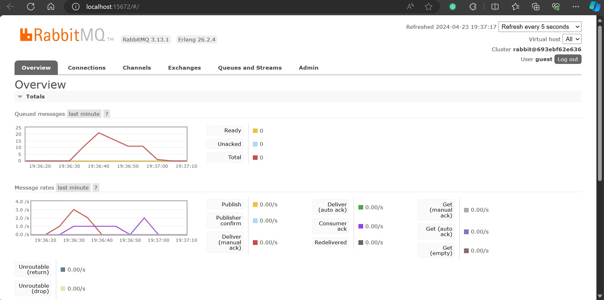

# 1. Apa itu `amqp`?
AMQP adalah singkatan dari Advanced Message Queuing Protocol. Ini adalah protokol komunikasi yang terstandarisasi yang digunakan untuk pertukaran pesan antara aplikasi atau sistem. AMQP dirancang untuk mendukung komunikasi yang andal, aman, dan efisien antara komponen perangkat lunak yang berbeda, terutama dalam lingkungan yang terdistribusi atau cloud.

Dalam konteks kode `main.rs`, AMQP digunakan untuk berkomunikasi dengan antrean pesan. Kode tersebut menggunakan AMQP untuk berinteraksi dengan antrean pesan di server RabbitMQ, yang berjalan di localhost pada port 5672, dengan nama pengguna dan kata sandi tamu (guest:guest).

Antrean pesan memungkinkan aplikasi untuk mengirim pesan ke satu sisi antrean dan membacanya dari sisi lainnya secara asinkron. Dalam kode tersebut, antrean "user_created" digunakan untuk menerima pesan yang akan diproses oleh UserCreatedHandler.

# 2. Apa arti dari "guest:guest@localhost:5672"?
`guest:guest@localhost:5672` adalah sebuah URL yang menyimpan informasi tentang koneksi ke server RabbitMQ. Mari kita bahas setiap bagian dari URL tersebut:

guest:guest: Ini adalah pasangan nama pengguna dan kata sandi yang digunakan untuk autentikasi saat terhubung ke server RabbitMQ. Dalam kasus ini, nama pengguna dan kata sandi keduanya adalah "guest". Namun, ini bukanlah praktik keamanan yang baik untuk digunakan di lingkungan produksi. Biasanya, Anda akan menggunakan kredensial yang aman untuk mengakses server RabbitMQ.
localhost:5672: Ini adalah alamat server RabbitMQ yang ingin Anda hubungi. localhost mengacu pada komputer lokal tempat kode dijalankan. Port 5672 adalah port default yang digunakan oleh RabbitMQ untuk menerima koneksi. Jadi, secara keseluruhan, ini berarti koneksi akan dilakukan ke server RabbitMQ yang berjalan di komputer lokal pada port 5672.

# Simulation slow subscriber

Queued messages pada message broker akan bertambah karena adanya delay yang diberikan, sehingga publisher lebih cepat mengirim dibandingkan subscriber yang menerima. Pada kasus saya, banyaknya queued messages pada message broker adalah 20 untuk 6 kali melakukan run Publisher.
